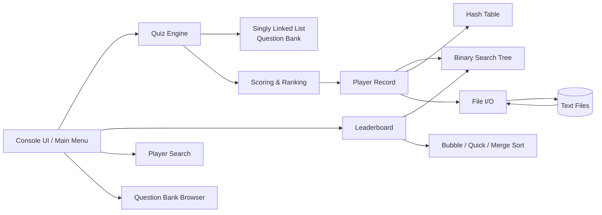
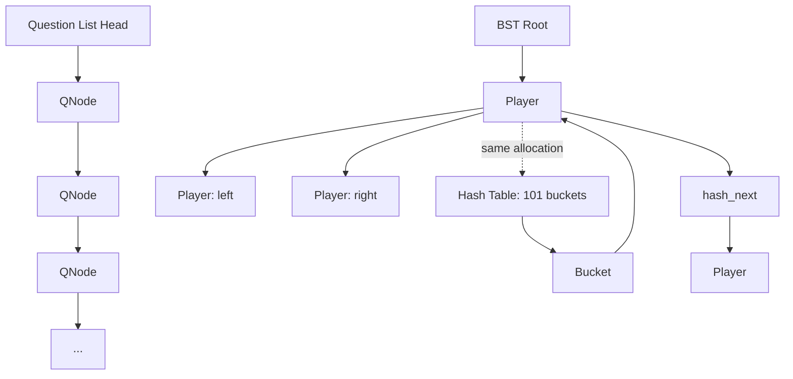
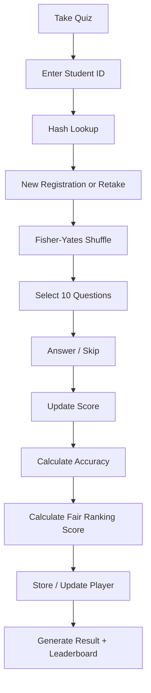
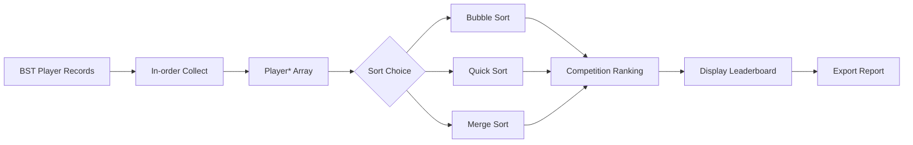

# DSA TRIVIA CHALLENGE
## Professional Software Design & Architecture Document

**Institution:** University of Brahmanbaria  
**Project:** DSA Trivia Challenge — Merged Edition  
**Implementation:** C11 / Console Application  
**Source basis:** `DSA_TRIVIA.c`

---

## 1. Executive Summary

DSA Trivia Challenge is a console-based quiz application designed to demonstrate practical **Data Structures and Algorithms** in one integrated system.

The implementation combines:
- a **singly linked list** for the dynamic question bank;
- a **hash table with separate chaining** for fast student-ID lookup;
- a **binary search tree (BST)** for player records ordered by student ID;
- **Bubble Sort, Quick Sort, and Merge Sort** for leaderboard comparison;
- **Fisher–Yates shuffle** for randomized quiz selection;
- a **student-ID decoder** for supported 7/8-digit roll formats;
- an accuracy-weighted **fair ranking score**;
- **competition ranking** for ties;
- text-file persistence and report generation.

The program uses 10 randomized questions per quiz attempt and a marking scheme of +1.00 for correct, −0.25 for wrong, and 0.00 for skipped questions.

---

## 2. System Goals

1. Register or recognize students by Student ID/Roll Number.
2. Randomly select 10 questions for each quiz attempt.
3. Record correct, wrong, and skipped responses.
4. Calculate raw score, accuracy, and fair ranking score.
5. Store player records across program sessions.
6. Display a leaderboard using a selectable sorting algorithm.
7. Search player records by Student ID.
8. Allow verified students to browse the question bank.
9. Export individual result transcripts and leaderboard reports.

---

## 3. High-Level Architecture




---

## 4. Core Components

| Component | Primary responsibility | Main implementation |
|---|---|---|
| Console UI | Menus, input, progress display | `show_main_menu`, input helpers |
| Question Bank | Stores quiz questions dynamically | `QNode` singly linked list |
| Hash Table | Fast player lookup by ID | DJB2 + separate chaining |
| BST | Stores player records ordered by ID | `Player.left/right` |
| Quiz Engine | Random selection and answer processing | Fisher–Yates + session loop |
| Scoring | Raw score, accuracy, ranking score | `apply_answer_result`, `finalize_scores` |
| Leaderboard | Sorts and ranks players | Bubble / Quick / Merge |
| Persistence | Saves and restores player data | `players_scores.txt` |
| Reporting | Result and leaderboard exports | transcript/report writers |
| ID Decoder | Extracts batch/year/serial where valid | `decode_roll_no` |

---

## 5. Data Model

### 5.1 Question Node

Each question is represented by a `QNode` containing question number, question text, four answer options, correct option, and a pointer to the next question.

```text
+-------------------------------+
| QNode                         |
+-------------------------------+
| qno                           |
| question[256]                 |
| options[4][128]               |
| correct_option                |
| next ------------------------>|----> next QNode
+-------------------------------+
```

### 5.2 Player Record

The `Player` structure intentionally serves two indexes at once. One allocation can participate in both the BST and the hash table.

```text
+---------------------------------------------+
| Player                                      |
+---------------------------------------------+
| name / id / batch / dept                    |
| total / attempted / correct / wrong / skip |
| raw_score / accuracy / ranking_score / rank |
| left / right                                |
| hash_next                                   |
+---------------------------------------------+
```

### 5.3 Supporting Structures

`HashTable` contains 101 bucket pointers. `AnswerRecord` stores the question ID and selected option for transcript generation.

---

## 6. Data-Structure Relationship Diagram




---

## 7. Quiz Session Design

1. Student enters ID.
2. ID decoder checks the supported 7/8-digit pattern.
3. Hash table lookup checks whether the student already exists.
4. Existing students may retake and overwrite their record.
5. New students provide batch/name/department when necessary.
6. The question pool is converted to an array of pointers and shuffled using Fisher–Yates.
7. Exactly 10 questions are selected.
8. Each answer is classified as correct, wrong, or skipped.
9. Scores are finalized and the player record is stored or updated.




---

## 8. Scoring & Ranking Design

| Response | Effect |
|---|---:|
| Correct | +1.00 |
| Wrong | −0.25 |
| Skipped | 0.00 |

**Accuracy**

`Accuracy = Correct / Attempted × 100`

**Fair Ranking Score**

For a positive raw score:

`RankingScore = RawScore × (0.50 + 0.50 × Accuracy/100)`

If the raw score is not positive, the ranking score equals the raw score.

**Competition ranking:** equal scores share a rank, producing patterns such as `1, 2, 2, 4`.

---

## 9. Leaderboard Architecture

The leaderboard collects BST records into a `Player*` array and lets the user choose Bubble Sort, Quick Sort, or Merge Sort. All three algorithms use the same comparator.

**Comparator priority**
1. Ranking score — descending
2. Accuracy — descending
3. Raw score — descending
4. Student ID — ascending




---

## 10. Persistence & Reporting

### Player database

`players_scores.txt` is rewritten during save operations.

```text
name|id|batch|dept|total_q|attempted|correct|wrong|raw_score|accuracy|ranking_score
```

### Individual transcript

Each completed quiz creates:

`result_<StudentID>.txt`

It includes student details, date/time, question-by-question results, selected answers, correct answers when needed, score, accuracy, fair ranking score, and rank.

### Leaderboard report

`leaderboard_report.txt` contains the complete sorted leaderboard, selected sorting algorithm, timing, and competition-ranking rule.

---

## 11. Main Menu

```text
+--------------------------------------+
|          DSA TRIVIA CHALLENGE        |
+--------------------------------------+
| [1] Take Quiz                        |
| [2] View Leaderboard                 |
| [3] Search Player by ID              |
| [4] Browse Question Bank             |
| [5] Exit                             |
+--------------------------------------+
```

Question-bank browsing is protected by hash-table verification: a student must already have a quiz record.

---

## 12. Complexity Analysis

| Operation | Structure / Algorithm | Expected / Worst-case |
|---|---|---|
| Question append | Singly linked list | O(n) |
| Count questions | Linked-list traversal | O(q) |
| Student lookup | Hash table | O(1) average / O(p) worst |
| BST search | Binary search tree | O(log p) average / O(p) worst |
| BST insertion | Binary search tree | O(log p) average / O(p) worst |
| BST in-order collection | BST traversal | O(p) |
| Shuffle | Fisher–Yates | O(q) |
| Bubble Sort | Array | O(p²) |
| Quick Sort | Array | O(p log p) average |
| Merge Sort | Array | O(p log p) |
| Competition ranking | Sorted array | O(p) |

Where `q` is the number of questions and `p` is the number of players.

---

## 13. Memory & Ownership Model

- Each `QNode` is dynamically allocated and released by `free_question_bank()`.
- New player records are heap allocated.
- The BST and hash table reference the same `Player` allocations.
- The leaderboard uses a temporary array of `Player*`, so sorting moves pointers rather than full structures.
- Temporary arrays are released after use.

---

## 14. Module Map

```text
DSA_TRIVIA.c
│
├── Configuration
├── Data Structures
├── Global State
├── UI Utilities
├── Roll / Student ID Decoder
├── Question Bank
├── Hash Table
├── Binary Search Tree
├── Sorting Algorithms
├── Scoring
├── File I/O
├── Quiz Engine
├── Menu Handlers
└── Main Program
```

---

## 15. Refactoring Recommendation

For a production-quality version, the monolithic file can be separated into:

```text
src/
├── main.c
├── ui.c / ui.h
├── question_bank.c / question_bank.h
├── hash_table.c / hash_table.h
├── bst.c / bst.h
├── sorting.c / sorting.h
├── scoring.c / scoring.h
├── quiz.c / quiz.h
├── storage.c / storage.h
└── reports.c / reports.h
```

This preserves the current algorithms while improving maintainability, testing, and reuse.

---

## 16. Build & Execution

```bash
gcc -Wall -Wextra -std=c11 dsa_trivia_merged.c -o dsa_trivia_merged
./dsa_trivia_merged
```

---

## 17. Design Strengths

- Multiple DSA concepts are integrated into one complete application.
- Hash lookup provides fast Student ID authentication/search.
- BST provides ordered player storage and traversal.
- The same Player allocation serves both the BST and hash index.
- Three sorting algorithms enable direct performance comparison.
- Fisher–Yates produces randomized quiz sessions.
- The ranking metric considers both score and accuracy.
- Player data persists between executions.
- Human-readable transcripts and leaderboard reports are generated.
- Input validation and allocation/file-error checks are present.

---

## 18. Conclusion

DSA Trivia Challenge demonstrates how classical data structures and algorithms can cooperate inside a real console application. The question bank, player indexing, randomization, scoring, ranking, sorting, and persistence form one execution pipeline from student authentication through final leaderboard reporting.

The key architectural feature is the dual indexing of Player records: the BST supports ordered storage and traversal, while the hash table provides fast ID-based lookup without duplicating player allocations.
