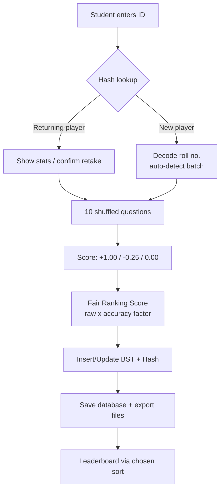

# 🎯 DSA Trivia Challenge

> A console-based MCQ quiz application built **from scratch in C** to demonstrate 10 classic Data Structures & Algorithms working together in one real system.
>
> **University of Brahmanbaria — Data Structures & Algorithms Project (Version 2.0)**


---

## 📋 Table of Contents

- [About the Project](#-about-the-project)
- [Demo](#-demo)
- [The 10 DSA Concepts Demonstrated](#-the-10-dsa-concepts-demonstrated)
- [How It Works](#⚙️-how-it-works)
- [Getting Started](#-getting-started)
- [Using the Program](#-using-the-program)
- [Project Structure](#-project-structure)
- [Scoring System](#-scoring-system)
- [Student ID Format](#-student-id-format)
- [File Outputs](#-file-outputs)
- [Complexity Summary](#-complexity-summary)
- [Design Highlights](#-design-highlights)
- [Troubleshooting](#-troubleshooting)
- [Author](#-author)

---

## 📖 About the Project

**DSA Trivia Challenge** is a terminal quiz game where university students register with their Student/Roll ID, answer **10 randomized questions** picked from a **60-question bank**, and get ranked on a global leaderboard using an accuracy-weighted fair scoring system.

Unlike a typical "array + printf" student project, every feature is powered by a genuine data structure or algorithm — from the singly linked list that holds the question bank, to the DJB2 hash table that authenticates returning players in O(1), to three different sorting algorithms competing on the same leaderboard.

### Key Features

- 🧑‍🎓 **Student registration & authentication** via hash table (instant returning-player lookup)
- 🔀 **Fisher–Yates shuffled** question selection — every attempt is different
- 📊 **Three sorting algorithms** (Bubble / Quick / Merge) with live timing comparison
- 🏆 **Competition ranking** — tied scores share a rank (`1, 2, 2, 4 …`)
- 🎯 **Accuracy-weighted Fair Ranking Score** that resists blind guessing
- 🪪 **Smart Roll Number decoder** — auto-detects admission year, batch & serial
- 💾 **Persistent player database** saved to disk after every quiz
- 🧾 **Detailed per-question result transcripts** exported as text files
- 🎨 **Colored boxed UI** with live progress bars (graceful on plain terminals)
- 🔒 **Access-controlled question bank** — only students who completed a quiz can browse it

---

## 🎬 Demo

```
+==============================================================================+
|                     UNIVERSITY OF BRAHMANBARIA                               |
|                     DSA TRIVIA CHALLENGE                                     |
+==============================================================================+
  Quiz Rules: 10 randomized MCQs
  Marking: Correct +1.00 | Wrong -0.25 | Skip 0.00
  [Status] 60 Questions in Bank  |  3 Player Records

  >>> MAIN MENU <<<
+==============================================================================+
|  [1] Take Quiz                                                               |
|  [2] View Leaderboard                                                        |
|  [3] Search Player by ID                                                     |
|  [4] Browse Question Bank                                                    |
|  [5] Exit                                                                    |
+==============================================================================+

  >> Select Option (1-5):
```
---

## 🧠 The 10 DSA Concepts Demonstrated

| # | Concept | Implementation | Where in Code |
|---|---------|----------------|---------------|
| 1 | **Singly Linked List** | 60-question dynamic bank, tail insertion | `QNode`, `add_question()` |
| 2 | **Hash Table (Chaining)** | DJB2 string hashing → 101 buckets → O(1) avg ID lookup | `hash_function()`, `hash_lookup()` |
| 3 | **Binary Search Tree** | Player records indexed by Student ID; in-order export | `bst_insert()`, `bst_inorder_collect()` |
| 4 | **Bubble Sort** | O(n²) leaderboard baseline with early-exit flag | `bubble_sort_players()` |
| 5 | **Quick Sort** | Lomuto partition, O(n log n) average | `quick_sort_players()`, `partition_players()` |
| 6 | **Merge Sort** | Stable O(n log n), used for rank computation | `merge_sort_players()`, `merge_players()` |
| 7 | **Fisher–Yates Shuffle** | Unbiased random selection of 10 questions | `shuffle_indices()` |
| 8 | **Roll/ID Decoder** | Parses `YY-S-0-SERIAL` → Year / Batch / Serial | `decode_roll_no()` |
| 9 | **Fair Ranking Score** | Accuracy-weighted composite metric | `finalize_scores()` |
| 10 | **Competition Ranking** | Ties share a rank (`1, 2, 2, 4 …`) | `assign_competition_ranks()` |

> **Design gem:** each `Player` node lives in **both** the BST *and* the hash table at once — one heap allocation, two indexes, zero synchronization problems.

---

## ⚙️ How It Works



### Architecture Layers

```
PRESENTATION   boxed banners, progress bars, validated input readers
MENU CONTROL   take quiz / leaderboard / search / browse / exit
CORE ENGINES   quiz engine, sorting engine, ID decoder, ranking engine
DATA LAYER     Question Linked List | Player BST | Hash Table (101)
PERSISTENCE    players_scores.txt | result_<ID>.txt | leaderboard_report.txt
```

---

## 🚀 Getting Started

### Prerequisites

- **GCC** (MinGW on Windows, gcc on Linux/macOS)
- A terminal that supports ANSI colors (optional — works fine without)

### Compile from Source

```bash
# Linux / macOS
gcc -Wall -Wextra -std=c11 DSA_TRIVIA.c -o dsa_trivia
./dsa_trivia
```

```powershell
# Windows (MinGW)
gcc -Wall -Wextra -std=c11 DSA_TRIVIA.c -o dsa_trivia_main_v8.exe
dsa_trivia_main_v8.exe
```

### Quick Start (prebuilt executable)

```powershell
# Windows — just download and run
dsa_trivia_main_v8.exe
```

> The executable is portable and self-contained. It creates its data files (`players_scores.txt`, etc.) in the **current working directory**.

---

## 🎮 Using the Program

| Option | What It Does |
|--------|--------------|
| **1 — Take Quiz** | Register (or retake) → answer 10 random MCQs → get scored, ranked, and a transcript file |
| **2 — View Leaderboard** | Pick Bubble / Quick / Merge sort → see the ranked table with live timing in milliseconds |
| **3 — Search Player by ID** | Hash-table lookup → full player profile card with hash bucket index shown |
| **4 — Browse Question Bank** | Access-controlled: only IDs with a completed quiz can view all 60 questions with answers |
| **5 — Exit** | Frees all heap memory and closes cleanly |

### Quiz Flow

1. Enter your **Student ID** (e.g. `2520853`)
2. The **ID decoder** auto-fills your batch if the format matches
3. Confirm your name & department
4. Answer 10 questions — type `1–4` or `0` to skip
5. View your result card, transcript file, and leaderboard rank

---

## 📁 Project Structure

```
## 📂 Project Directory Structure
DSA_Trivia/
│
├── Diagram/
│   ├── Data Structure Diagram.png
│   ├── diagram1_architecture.png
│   ├── diagram2_menu_loop.png
│   ├── diagram3_take_quiz.png
│   ├── diagram4_data_structures.png
│   ├── diagram5_sorting.png
│   ├── diagram6_fileio.png
│   ├── Main Program Flowchart.png
│   └── System Architecture Module Overview.png
│
├── Documents/
│   ├── DSA-Tivia-DD-v1.docx
│   ├── DSA-Tivia-DD-v2.docx
│   ├── DSA-Tivia-PI-v1.docs
│   ├── DSA-Tivia-PI-v2.md
│   ├── DSA-Tivia-PP-v1.txt
│   ├── DSA-Tivia-SRS-v1.docx
│   ├── DSA-Tivia-TR-v1.txt
│   ├── DSA-Tivia-DD-v3.docx
│   ├── DSA-Tivia-DD-v3.md
│   └── DSA-Tivia-DD-v8.md
│
├── Main/
│   ├── dsa_trivia_main_v8.c
│   └── dsa_trivia_main_v8.exe
│
├── Test/
│   ├── dsa_trivia_demo_v1.c
│   ├── dsa_trivia_demo_v2.c
│   ├── dsa_trivia_demo_v3.c
│   ├── dsa_trivia_main_v1.c
│   ├── dsa_trivia_main_v2.c
│   ├── dsa_trivia_main_v3.c
│   └── dsa_trivia_main_v6.c
│
└── README.md
```

### Source File Sections

| Section | Module |
|---------|--------|
| 0 | Configuration constants |
| 1 | Data structures (`QNode`, `Player`, `HashTable`) |
| 2–3 | Global state & prototypes |
| 4 | UI utilities |
| 5 | Roll/ID decoder |
| 6 | Question bank (linked list) |
| 7 | Hash table (DJB2 + chaining) |
| 8 | Binary search tree |
| 9 | Sorting module (bubble / quick / merge) |
| 10 | Scoring module |
| 11 | File I/O |
| 12 | Quiz engine |
| 13 | Menu handlers |
| 14 | `main()` |

---

## 🧮 Scoring System

| Action | Marks |
|--------|-------|
| ✅ Correct | `+1.00` |
| ❌ Wrong | `−0.25` (score floors at 0.00) |
| ⏭️ Skip | `0.00` |

```text
accuracy        = correct / attempted × 100
ranking_score   = raw_score × (0.50 + 0.50 × accuracy/100)  [if raw > 0]
                = raw_score                                   [otherwise]
```

**Why accuracy-weighted?** Volume alone isn't skill. A player who answers carefully and skips when unsure outranks one who guesses on everything — the multiplier ranges from `0.50` (0% accuracy) to `1.00` (100% accuracy).

| Player | Correct/Wrong/Skip | Raw | Accuracy | Ranking Score |
|--------|--------------------|----|----|----|
| A | 10/0/0 | 10.00 | 100% | **10.00** |
| B | 8/2/0 | 7.50 | 80% | **6.75** |
| C | 6/0/4 | 6.00 | 100% | **6.00** |
| D | 9/8/0 | 7.00 | 53% | **5.36** |

---

## 🪪 Student ID Format

The decoder recognizes 7–8 digit numeric IDs in the layout **`YY-S-0-SERIAL`**:

```
  2  5  2  0  8  0  0
  │  │  │  │  └──┴──┴─ SERIAL   = 800
  │  │  │  └────────── divider  = 0 (fixed)
  │  │  └───────────── semester = 2  (1 = Spring, 2 = Fall)
  │  └──────────────── year    = 25 → 2025
  └─────────────────── batch   = "252" (first 3 digits)

  → "Admission Year: 2025 | Batch: 252 | Serial: 800"
```

IDs that don't match this shape are accepted as free-form IDs (batch entered manually).

---

## 📄 File Outputs

| File | Format | Purpose |
|------|--------|---------|
| `players_scores.txt` | `name\|id\|batch\|dept\|total_q\|attempted\|correct\|wrong\|raw\|accuracy\|ranking_score` | Full player database, rewritten atomically on every save |
| `result_<ID>.txt` | Human-readable transcript | Question-by-question breakdown with your answer, correct answer, and final scores |
| `leaderboard_report.txt` | Fixed-width table | Latest leaderboard with the sort algorithm used and its measured time |

---

## 📈 Complexity Summary

| Feature | Structure / Algorithm | Time | Space |
|---------|----------------------|------|-------|
| Question storage | Singly linked list | access O(n), insert O(1) | O(1)/node |
| Player authentication | Hash table (DJB2, chaining, 101 buckets) | **O(1)** average | O(n) |
| Player enumeration by ID | BST in-order | O(n) | O(n) |
| Question randomization | Fisher–Yates | O(n) | O(n) temp |
| Leaderboard (baseline) | Bubble sort | O(n²) | O(1) |
| Leaderboard (fast) | Quick / Merge sort | **O(n log n)** | O(log n) / O(n) |
| Rank assignment | Single pass with EPS tolerance | O(n) | O(1) |

---

## 💡 Design Highlights

1. **One node, two indexes** — every `Player` lives in the BST *and* a hash chain simultaneously; retakes surgically preserve link fields across the overwrite.
2. **One comparator, three sorts** — Bubble/Quick/Merge produce *identical* leaderboard order; only the measured time differs, turning Option 2 into a live complexity-theory demo.
3. **Fair scoring** — the accuracy multiplier makes blind guessing a losing strategy.
4. **Robust input** — everything is read with `fgets`; the integer parser rejects `5x`-style garbage, blank lines, and out-of-range values.
5. **Crash-safe persistence** — the database is fully rewritten per save, so no half-written records; malformed lines are skipped on load.
6. **Clean shutdown** — linked list freed iteratively, BST freed post-order; zero leaks on exit.
7. **Entropy hardening** — RNG is reseeded with `time ^ clock ^ counter` so rapid retakes don't repeat question orders.

---

## 🛠️ Troubleshooting

| Problem | Fix |
|---------|-----|
| Colors look like garbage | Your terminal doesn't support ANSI — the program still works; try Windows Terminal, VS Code terminal, or Linux/macOS default |
| `gcc: command not found` | Install MinGW-w64 (Windows) or `build-essential` (Linux) / Xcode CLT (macOS) |
| Data files not appearing | They're written to the **current working directory** — run the exe from a folder you own |
| Want a fresh start | Delete `players_scores.txt` and the `result_*.txt` files |
| Screen doesn't clear | `clear`/`cls` is chosen at compile time via `_WIN32`; recompile on the platform you run on |

---

## 👤 Author

**Ashraful Islam**
- 🎓 University of Brahmanbaria
- 🔗 GitHub: [@ashraful1625](https://github.com/ashraful1620)
- 📦 Repository: [github.com/ashraful1625/DSA_Trivia](https://github.com/ashraful1625/DSA_Trivia)

---

## 📜 License

This project is released under the **MIT License** — free to use, modify, and distribute with attribution.

```
MIT License — Copyright (c) 2026 Ashraful Islam
Permission is hereby granted, free of charge, to any person obtaining a copy
of this software and associated documentation files (the "Software"), to deal
in the Software without restriction...
```

---

<div align="center">

**If this project helped you learn DSA, consider giving it a ⭐ on GitHub!**

</div>
